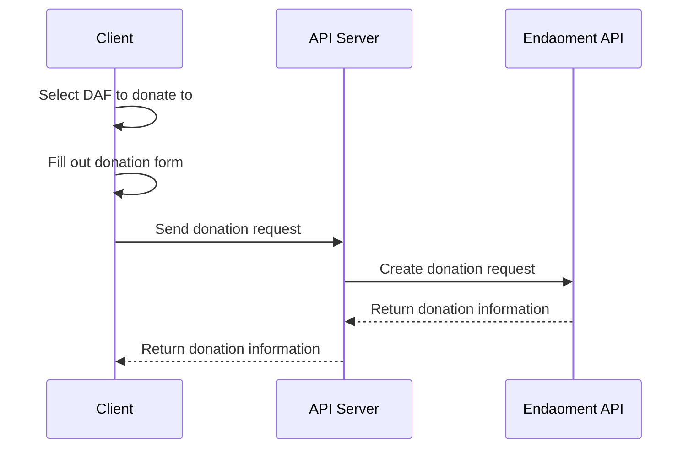

# Donating to a Donor-Advised Fund (DAF) Guide

Welcome to the Donating to a Donor-Advised Fund (DAF) Guide. This document will walk you through the process of donating to a Donor-Advised Fund (DAF) on the Endaoment platform.

We will be creating a simple donation flow that will allow users to donate to a Donor-Advised Fund (DAF) on the Endaoment platform. This guide will cover adding a donation form to your frontend, preparing a donation URL, and processing the donation.

## Prerequisites

Before you begin, ensure your application is capable of the following flows:

- [Logging in a user](./login-user.md) as users must be authenticated to grant out of a DAF
- [Opening a DAF](./open-daf.md) as you will need to select a DAF to grant out of

## Flow Overview

## Step-by-Step Instructions

### 1. Set up the donation form

> TODO

### 2. Orchestrate the donation request

> TODO

### (Optional) 3. Display validation errors

> TODO

## Conclusion

> TODO
