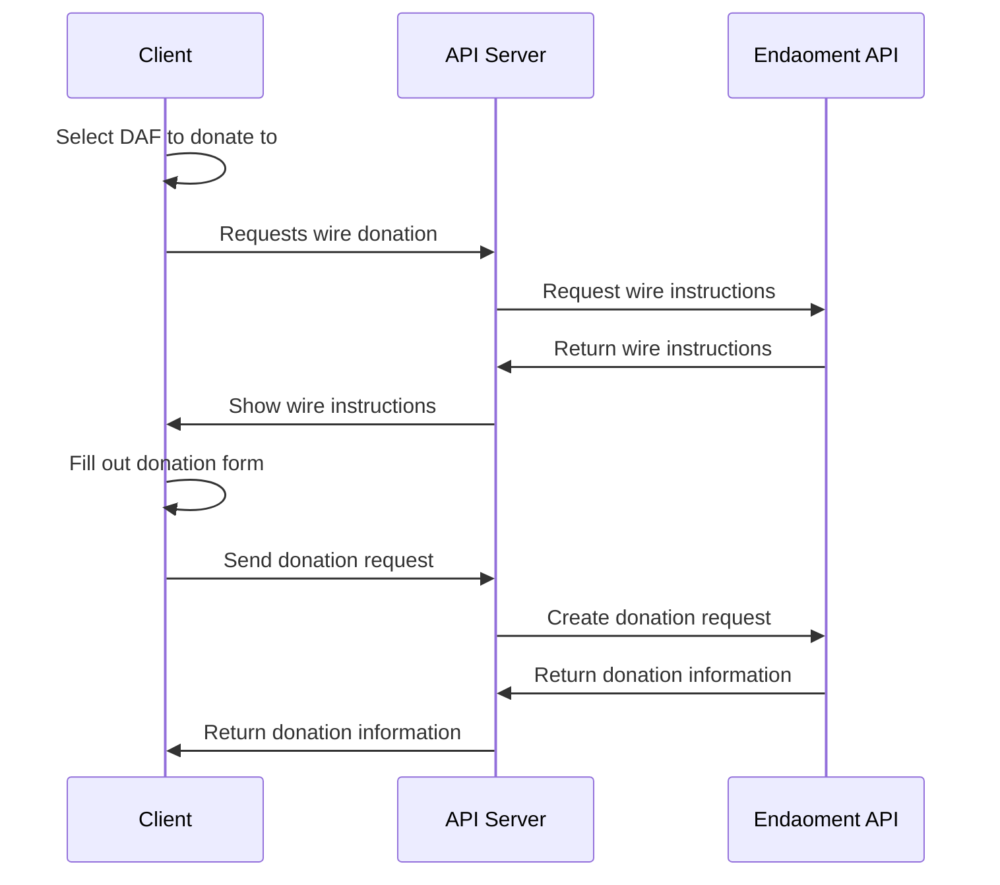
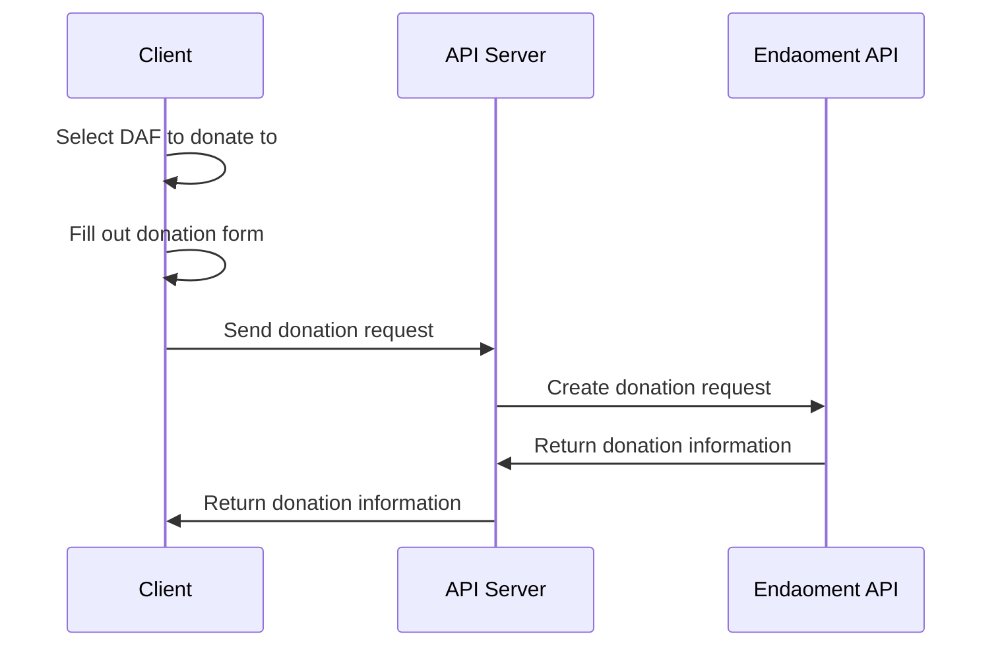
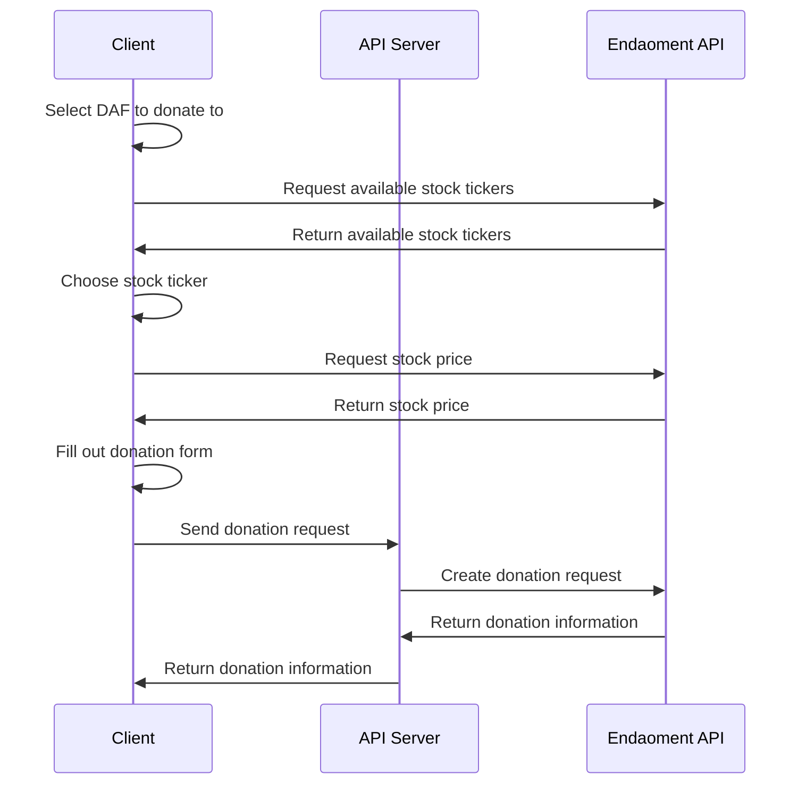
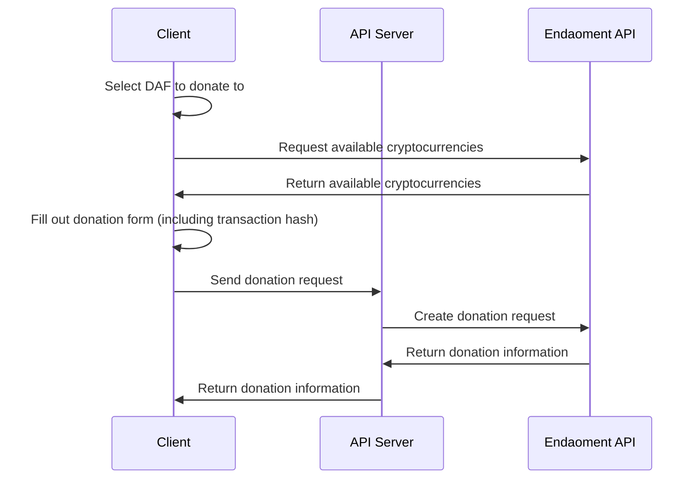

# Donating to a Donor-Advised Fund (DAF) Guide

Welcome to the Donating to a Donor-Advised Fund (DAF) Guide. This document will walk you through the process of donating to a Donor-Advised Fund (DAF) on the Endaoment platform.

We will be creating a simple donation flow that will allow users to donate to a Donor-Advised Fund (DAF) on the Endaoment platform. This guide will cover adding a donation form to your frontend, preparing a donation URL, and processing the donation.

Since there are a variety of donation types (cash, stock, crypto), we will cover each type in a separate section. Please refer to the appropriate section based on the donation type you would like to implement.

## Prerequisites

Before you begin, ensure your application is capable of the following flows:

- [Logging in a user](./login-user.md) as users must be authenticated to grant out of a DAF
- [Opening a DAF](./open-daf.md) as you will need to select a DAF to grant out of

## Flow Overview

### Wire Cash Donation



<!--
### Custodial Cash Donation



### Stock Donation



### Crypto Donation


-->

## Step-by-Step Instructions (Wire Cash Donation)

### 1. Set up fund selection

In order for the user to initiate any donation, they must first select a DAF to donate to. This can be done by listing the available DAFs for the user to choose from. The list of available DAFs should be retrieved from the Endaoment API through the use of your backend server. Create a route on your backend server that will make a request to the Endaoment API to retrieve the list of DAFs `/get-dafs`.

```javascript
// This is the part that should be called by your `get-dafs` route handler
async function getDafs(req, res) {
  // Get the Endaoment access token for the user
  // This is a placeholder function, you should replace it with your own implementation
  const token = getAccessToken(req);

  // Make a request to the Endaoment API to get the list of DAFs
  const usersDafList = await fetch('https://api.endaoment.com/v1/funds/mine', {
    method: 'GET',
    headers: {
      'Content-Type': 'application/json',
      // Pass the user's token in the Authorization header
      Authorization: `Bearer ${token}`,
    },
  });

  // We can now return the response to the frontend
  res.status(200);
  res.json(await usersDafList.json());
  res.end();
}
```

You can now call this route from your frontend to retrieve the list of DAFs available to the user. This example uses React, but you can use any frontend framework or vanilla JavaScript.

For more details about the `https://api.endaoment.com/v1/funds/mine` API being called, check the [API docs](https://api.dev.endaoment.org/oas#/Funds/FundsController_getMyFunds)

```javascript
const DafList = () => {
  const [dafs, setDafs] = useState([]);

  useEffect(() => {
    fetch('/get-dafs')
      .then((res) => res.json())
      .then((data) => setDafs(data));
  }, []);

  return (
    <div>
      <h1>Select a DAF to donate to</h1>
      <div>
        {dafs.map((daf) => (
          <button
            key={daf.id}
            onClick={
              // Handle the selection of the DAF here
              () => console.log(`Selected DAF: ${daf.name}`)
            }>
            {daf.name}
          </button>
        ))}
      </div>
    </div>
  );
};
```

You can now display the list of DAFs to the user and allow them to select a DAF to donate to. Once the user has selected a DAF, they can proceed to entering in their own details.

### 2. Retrieve wire instructions

Since the user will be donating using a wire transfer, they will need to be provided with the wire instructions for Endaoment. Create a route on your backend server that will make a request to the Endaoment API to retrieve the wire instructions for the selected DAF `/get-wire-instructions`.

```javascript
// This is the part that should be called by your `get-wire-instructions` route handler
async function getWireInstructions(req, res) {
  // Make a request to the Endaoment API to get the wire instructions
  const wireInstructions = await fetch(
    // For domestic wire instructions
    'https://api.endaoment.com/v1/donation-pledges/wire/details/domestic',
    // For international wire instructions
    // 'https://api.endaoment.com/v1/donation-pledges/wire/details/international',
    {
      method: 'GET',
      headers: {
        'Content-Type': 'application/json',
        //   This does not need any authentication since this is public information
      },
    }
  );

  // We can now return the response to the frontend
  res.status(200);
  res.json(await wireInstructions.json());
  res.end();
}
```

You can find the API for those endpoints here:

- [Domestic Wire Details API](https://api.dev.endaoment.org/oas#/Donation%20Pledges/DonationPledgesController_getDomesticPledgeDetails)
- [International Wire Details API](https://api.dev.endaoment.org/oas#/Donation%20Pledges/DonationPledgesController_getInternationalPledgeDetails)

You can now call this route from your frontend to retrieve the wire instructions when a user decides to donate to a DAF.

> Remember that the wire instructions can change, so it is recommended to fetch the wire instructions each time a user decides to donate.

### 2. Set up the donation form

Once the user has selected a DAF and selected to donate by wire, you should display the wire instructions to the user and ask them to enter the amount they would like to donate in a simple form.

```html
<div>
  <h1>Wire Instructions</h1>
  <p>Please wire your donation to the following account</p>
  <p>Bank: {wireInstructions.receivingBank.name}</p>
  <p>Routing Number: {wireInstructions.receivingBank.abaRoutingNumber}</p>
  <form action="/wire-donation" method="POST">
    <label>Amount</label>
    <input type="number" />
    <input type="hidden" name="fundId" value="{selectedDafId}" />
    <button>Donate</button>
  </form>
</div>
```

With the donation form set up, the user can now enter the amount they would like to donate and submit the form. The donation request will be sent to your backend server on the `/wire-donation` route. We will set up this route in the next step.

### 3. Orchestrate the donation request

When the user submits the donation form, the details will be sent to your backend service. We will need to create an endpoint that can receive this information and then send it to the Endaoment API to create the donation request. For the purposes of this guide, we will assume that the endpoint is `/wire-donation`.

```javascript
const crypto = require('crypto');

// This is the part that should be called by your `wire-donation` route handler
async function wireDonation(req, res) {
  const amount = req.body['amount'];
  const receivingFundId = req.body['fundId'];

  if (!amount || !receivingFundId) {
    // Return an error response if any of the required fields are missing
    res.status(400);
    res.end();
    return;
  }

  // Get the Endaoment access token for the user
  // This is a placeholder function, you should replace it with your own implementation
  const token = getAccessToken(req);

  // Generate a unique key for the donation request
  // This can be generated by anything that is unique to the donation request
  const idempotencyKey = crypto.randomUUID();

  // Convert the amount to microdollars
  // 1 dollar = 1,000,000 microdollars
  // The actual formula for the conversion will depend on how you handle currency and data types in your application
  const pledgedAmountMicroDollars = (BigInt(amount) * 1000000n).toString();

  // Make a request to the Endaoment API to create the donation request
  const donationRequest = await fetch(
    'https://api.endaoment.com/v1/donation-pledges/wire',
    {
      method: 'POST',
      headers: {
        'Content-Type': 'application/json',
        // Pass the user's token in the Authorization header
        Authorization: `Bearer ${token}`,
      },
      body: JSON.stringify({
        pledgedAmountMicroDollars,
        receivingFundId,
        idempotencyKey,
      }),
    }
  );

  // We can now return the response to the frontend
  res.status(200);
  res.json(await donationRequest.json());
  res.end();
}
```

The request to the Endaoment API will require the following fields:

```typescript
{
    // The amount the user would like to donate in microdollars
    pledgedAmountMicroDollars: bigint,
    // The ID of the DAF the user would like to donate to
    receivingFundId: string,
    // A unique key to ensure the donation request is idempotent
    // This can be generated by anything that is unique to the donation request
    idempotencyKey: string,
}
```

While there are other fields that can be included in the donation form, these are the minimum required fields to create a donation request. You can learn more about the donation fields in the [API Reference docs.](https://api.dev.endaoment.org/oas#/Donation%20Pledges/DonationPledgesController_createWirePledge)

With the donation request sent to the Endaoment API, the donation will be processed and the user will receive a response containing the id of the donation pledge. It will be similar to the following:

```json
{
  "id": "00a1dv45-dx19-2301-2471-223932594567"
}
```

When the frontend receives this response, it can display a confirmation message to the user that their donation has been successfully processed.

### 4. Display donation confirmation

Once the donation request has been successfully processed, the user should be shown a confirmation message that their donation has been received. This can be done by displaying the donation pledge ID that was returned from the Endaoment API.

```html
<div>
  <h1>Donation Successful!</h1>
  <p>Your donation has been successfully processed</p>
  <p>Donation ID: {donationPledgeId}</p>
</div>
```

<!--
## Step-by-Step Instructions (Custodial Cash Donation)

### 1. Set up the donation form

> TODO

### 2. Orchestrate the donation request

> TODO

## Step-by-Step Instructions (Stock Donation)

### 1. Set up the donation form

> TODO

### 2. Orchestrate the donation request

> TODO

## Step-by-Step Instructions (Crypto Donation)

### 1. Set up the donation form

> TODO

### 2. Orchestrate the donation request

> TODO

 -->

## Conclusion

Congratulations! You have successfully implemented a donation flow to a Donor-Advised Fund (DAF) on the Endaoment platform. After completing this flow, users will be have funds available in their DAF! In order for these dollars to go towards the causes they care about, users can now begin the process of [granting to organizations](./grant-from-daf.md)!
