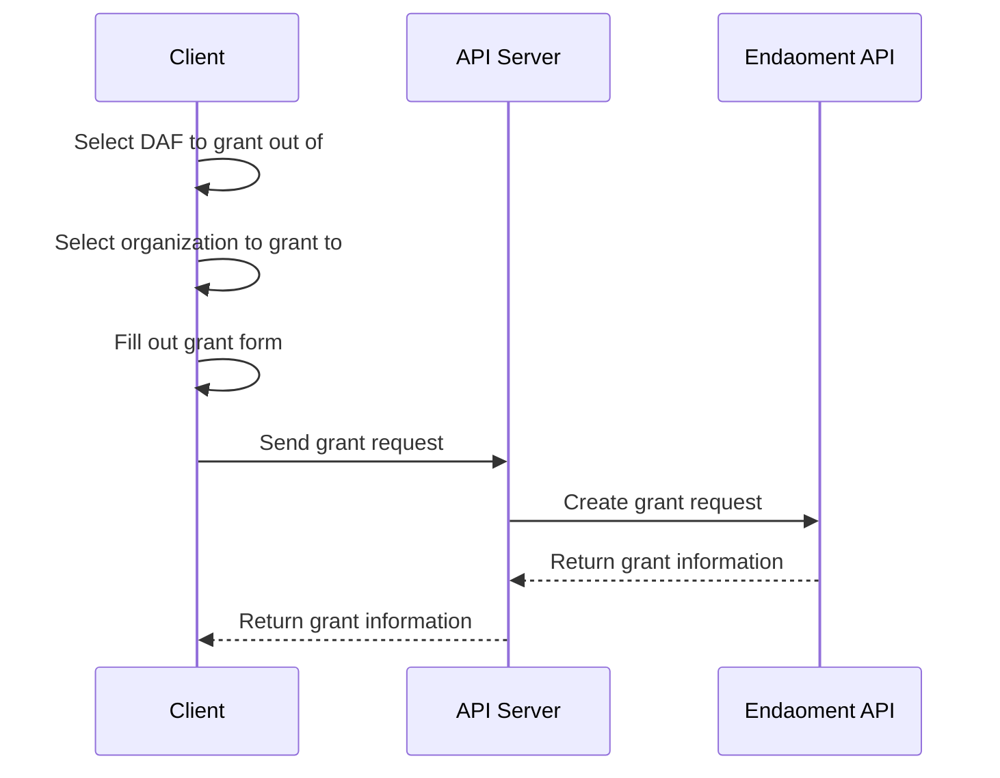

# Granting out of a Donor-Advised Fund (DAF) Guide

Welcome to the Granting out of a Donor-Advised Fund (DAF) Guide. This document will walk you through the process of granting out of a Donor-Advised Fund (DAF) on the Endaoment platform.

We will be creating a simple granting flow that will allow users to grant out of a Donor-Advised Fund (DAF) on the Endaoment platform. This guide will cover adding a grant form to your frontend, preparing a grant URL, and processing the grant.

## Prerequisites

Before you begin, ensure your application is capable of the following flows:

- [Logging in a user](./login-user.md) as users must be authenticated to grant out of a DAF
- [Opening a DAF](./open-daf.md) as you will need to select a DAF to grant out of
- [Searching for organizations](./search-for-org.md) as you will need to select an organization to grant to
- [Donating to a DAF](./donate-to-daf.md) as you will need to have funds available in the DAF to grant out

## Flow Overview



## Step-by-Step Instructions

### 1. Select DAF to grant out of

Similar to the process of [donating to a DAF](./donate-to-daf.md), you will need to select a DAF to grant out of. This can be done by fetching a list of DAFs the user has access to and allowing them to select one. If you have not already implemented this, you can follow the Set Up Fund Selection step in the [Donate to a DAF Guide](./donate-to-daf.md#-set-up-fund-selection).

```javascript
const DafList = () => {
  const [dafs, setDafs] = useState([]);

  useEffect(() => {
    fetch('/get-dafs')
      .then((res) => res.json())
      .then((data) => setDafs(data));
  }, []);

  return (
    <div>
      <h1>Select a DAF to grant from</h1>
      <div>
        {dafs.map((daf) => (
          <button
            key={daf.id}
            onClick={
              // Handle the selection of the DAF here
              () => console.log(`Selected DAF: ${daf.name}`)
            }>
            {daf.name}
          </button>
        ))}
      </div>
    </div>
  );
};
```

Once the user has selected a DAF, they can proceed to choose an organization to grant to. This may be the immediate next step or you might have a detail layout that describes the DAF where the user can choose to start a grant. This is entirely up to you and your application's design.

### 2. Select organization to grant to

Identical to the process of [searching for organizations](./search-for-org.md), you will need to allow the user to search for an organization to grant to. This can be done by fetching a list of organizations and allowing the user to search for the organization they wish to grant to. If you have not already implemented this, you can follow the Set Up Organization Search step in the [Search for Organizations Guide](./search-for-org.md#2-set-up-organization-search).

The difference here is that rather than simply listing the results, you will need to allow the user to select an organization to grant to.

```jsx
const OrgSelect = ({
    // Pass the results from the search request as a prop
    searchResults
    // Pass a function to handle selecting an organization
    onSelectOrg
    }) => {
    return (
        <div>
            {searchResults.map((org) => (
                <div key={org.id}>
                    <h3>{org.name}</h3>
                    <button onClick={() => onSelectOrg(org)}>Select</button>
                </div>
            ))}
        </div>
    )
}
```

This step is crucial as it allows the user to select the organization they wish to grant to. Once the user has selected an organization, they can proceed to fill out the grant form.

### 3. Set up the grant form

Now that the user has selected a DAF to grant out of and an organization to grant to, you can set up the grant form. This form will allow the user to specify the amount they would like to grant and the purpose of the grant.

```jsx
const GrantForm = ({ org, daf }) => {
  const [amount, setAmount] = useState('');
  const [purpose, setPurpose] = useState('');

  const handleGrant = () => {
    // Send the grant request to the server
    fetch('/grant', {
      method: 'POST',
      headers: {
        'Content-Type': 'application/json',
      },
      body: JSON.stringify({
        amount,
        fundId: daf.id,
        orgId: org.id,
        purpose,
      }),
    });
  };

  return (
    <form onSubmit={handleGrant}>
      <h1>Grant to {org.name}</h1>
      <label>Amount:</label>
      <input
        type="number"
        value={amount}
        onChange={(e) => setAmount(e.target.value)}
      />
      <label>Purpose:</label>
      <input
        type="text"
        value={purpose}
        onChange={(e) => setPurpose(e.target.value)}
      />
      <button type="submit">Grant</button>
    </div>
  );
};
```

The grant form will allow the user to specify the amount they would like to grant and the purpose of the grant. Once the user has filled out the form, they can submit the grant request to the server, which will then send the grant request to the Endaoment API.

### 4. Orchestrate the grant request

Similar to the process in [donating to a DAF](./donate-to-daf.md), you will need to send a grant request to the Endaoment API. This can be done by sending a POST request to a `/grant` endpoint on your backend with the necessary information and proxying to Endaoment.

```javascript
const crypto = require('crypto');

// This is the part that should be called by your `grant` route handler
async function grant(req, res) {
  const amount = req.body['amount'];
  const originFundId = req.body['fundId'];
  const destinationOrgId = req.body['orgId'];
  const purpose = req.body['purpose'];

  if (!amount || !originFundId || !destinationOrgId || !purpose) {
    // Return an error response if any of the required fields are missing
    res.status(400);
    res.end();
    return;
  }

  // Get the Endaoment access token for the user
  // This is a placeholder function, you should replace it with your own implementation
  const token = getAccessToken(req);

  // Generate a unique key for the donation request
  // This can be generated by anything that is unique to the donation request
  const idempotencyKey = crypto.randomUUID();

  // Convert the amount to microdollars
  // 1 dollar = 1,000,000 microdollars
  // The actual formula for the conversion will depend on how you handle currency and data types in your application
  const requestedAmount = (BigInt(amount) * 1000000n).toString();

  // Make a request to the Endaoment API to create the donation request
  const grantRequest = await fetch(
    'https://api.endaoment.com/v1/transfers/async-grants',
    {
      method: 'POST',
      headers: {
        'Content-Type': 'application/json',
        // Pass the user's token in the Authorization header
        Authorization: `Bearer ${token}`,
      },
      body: JSON.stringify({
        originFundId,
        destinationOrgId,
        requestedAmount,
        purpose,
        idempotencyKey,
      }),
    }
  );

  // We can now return the response to the frontend
  res.status(200);
  res.send(grantRequest);
  res.end();
}
```

The request to the Endaoment API will require the following fields:

```typescript
{
    // The ID of the DAF the user would like to grant from
    originFundId: string,
    // The ID of the organization the user would like to grant to
    destinationOrgId: string,
    // The amount the user would like to grant
    // This value should be in microdollars
    requestedAmount: string,
    // The purpose of the grant
    // This can be a description of the grant or whatever the user would like to specify
    purpose: string,
    // A unique key to ensure the donation request is idempotent
    // This can be generated by anything that is unique to the donation request
    idempotencyKey: string,
}
```

When the grant request is successful, the Endaoment API will return the grant information. You can then return this information to the frontend to display to the user. An example of the grant information is as follows:

```json
{
  "id": "2318a418-9242-405e-8e31-d89f5ba07296",
  "type": "GrantTransfer",
  "status": "Pending",
  "requestedAmount": "1000000",
  "purpose": "Grant from Endaoment"

  //   ...Other fields
}
```

For a full list of fields that can be returned in the grant information, refer to the [API Reference](../api-reference.md).

> TODO: Add link to API Reference

## Conclusion

Congratulations! You have successfully created a simple granting flow that allows users to grant out of a Donor-Advised Fund (DAF) on the Endaoment platform. Your users can now easily get money out of their DAFs and into the hands of the organizations they care about. At this point, you may want to consider adding additional features to your grant flow, such as recurring grants or grant tracking, but otherwise, you are set with a fully functional DAF system!
