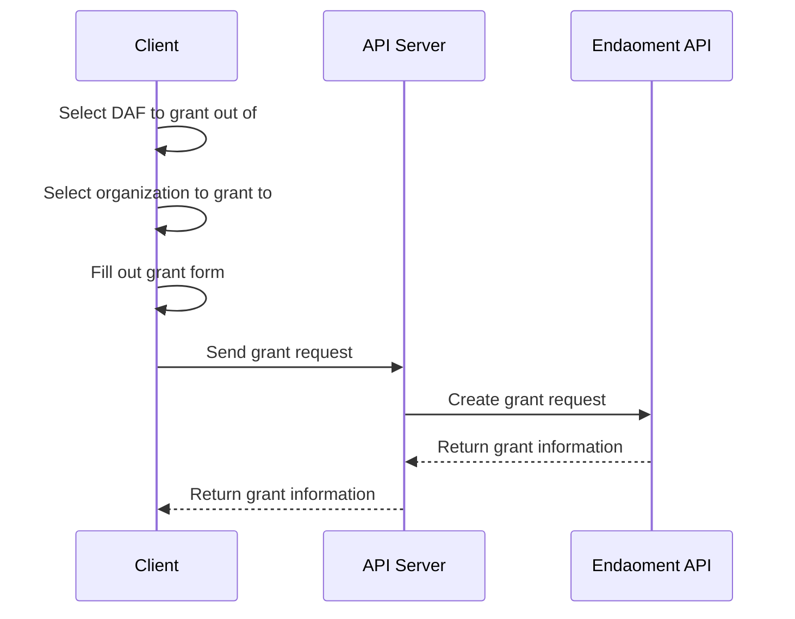

# Granting out of a Donor-Advised Fund (DAF) Guide

Welcome to the Granting out of a Donor-Advised Fund (DAF) Guide. This document will walk you through the process of granting out of a Donor-Advised Fund (DAF) on the Endaoment platform.

We will be creating a simple granting flow that will allow users to grant out of a Donor-Advised Fund (DAF) on the Endaoment platform. This guide will cover adding a grant form to your frontend, preparing a grant URL, and processing the grant.

## Prerequisites

Before you begin, ensure your application is capable of the following flows:

- [Logging in a user](./login-user.md) as users must be authenticated to grant out of a DAF
- [Opening a DAF](./open-daf.md) as you will need to select a DAF to grant out of
- [Searching for organizations](./search-for-org.md) as you will need to select an organization to grant to
- [Donating to a DAF](./donate-to-daf.md) as you will need to have funds available in the DAF to grant out

## Flow Overview

## Step-by-Step Instructions

### 1. Set up the grant form

> TODO

### 2. Orchestrate the grant request

> TODO

### (Optional) 3. Display validation errors

> TODO

## Conclusion

> TODO
