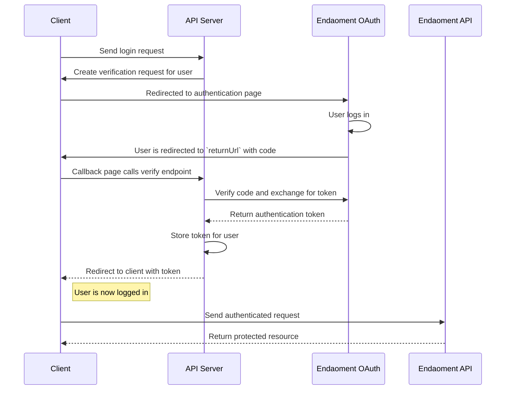

# User Login Guide

Welcome to the User Login Guide. This document will walk you through the process of logging in a user to your application.

We will be creating a simple login flow that will allow users to log in to your application using the Endaoment OAuth service. This guide will cover adding a login button to your frontend, preparing a login URL, and verifying a login to issue an authentication token.

In order to do this, we will be creating 2 endpoints on your backend service:

- `/init-login`: This endpoint will initiate the login process and return a URL to redirect the user to the Endaoment OAuth page.
- `/verify-login`: This endpoint will verify the login and exchange the code for an authentication token.

## Prerequisites

Before you begin, ensure you have the following:

- A webserver or API to handle verification requests
- A frontend application or client to allow users to interact with
- Basic understanding of HTTP requests
- A `clientId` and `clientSecret` from Endaoment (stored securely on your backend)

## Flow Overview



## Step-by-Step Instructions

### 1. Prepare the user interface

Before you can log in a user, you need to create a way for them to initiate the login process. This can be as simple as a button that sends a request to your backend service.

Your UI must send a request to your backend service to initiate the login process and then redirect the user to the Endaoment OAuth page to log in.

```js
// Send a request to your backend service to initiate the login process
const res = await fetch('/init-login', {
  method: 'POST',
  headers: {
    'Content-Type': 'application/json',
  },
});

// Redirect the user to the page returned by the backend service
window.location.href = res.url;
```

> It is extremely important that you do not store the `clientId` and `clientSecret` in your frontend application. This information should be kept secure on your backend service.

### 2. Create a Verifier and Challenge

Once your frontend has initiated the login process, your backend service must create a verification request for the user. This will require generating a `codeVerifier`, `codeChallenge`, and `state`.

```js
const crypto = require('crypto');
const fs = require('fs');
const path = require('path');

// Ensure URL safe encoding
function toUrlSafe(base64) {
  return base64.replace(/\+/g, '-').replace(/\//g, '_').replace(/=+$/g, '');
}

function generateCodeVerifier() {
  const randomBytes = crypto.randomBytes(32);
  crypto.getRandomValues(randomBytes);
  return toUrlSafe(Buffer.from(randomBytes).toString('base64'));
}

async function generateCodeChallenge(codeVerifier) {
  const hash = crypto.createHash('sha256');
  hash.update(codeVerifier);
  return toUrlSafe(hash.digest('base64'));
}

function saveOAuthState({ codeVerifier, codeChallenge, state }) {
  // Store the variables in a file, session, or database
  // The specific implementation will be up to your team and the requirements of your application
  fs.writeFileSync(
    path.join(__dirname, `${state}-exportedVariables.json`),
    JSON.stringify(
      {
        codeVerifier,
        codeChallenge,
        state,
      },
      null,
      2
    )
  );
}

// This is the part that should be called by your `init-login` route handler
async function initLogin(req, res) {
  const codeVerifier = generateCodeVerifier();
  const codeChallenge = await generateCodeChallenge(codeVerifier);

  // The state is a random string that is used to uniquely identify the login request
  // It can be whatever you want, but it should, ideally, be unique for each login
  const state = crypto.randomBytes(16).toString('hex');

  // It is important to store these values so that they can be accessed later to verify the login
  saveOAuthState({
    codeVerifier,
    codeChallenge,
    state,
  });

  // We will discuss how to use these values in the next step
  //...
}
```

### 3. Prepare the Login URL

Now that you have generated the `codeVerifier`, `codeChallenge`, and `state`, you can prepare the URL to redirect the user to the Endaoment OAuth page.

```js
// This is the part that should be called by your `init-login` route handler
async function initLogin(req, res) {
  // Continue from the previous step
  // ...

  // Prepare the URL to redirect the user to the Endaoment OAuth page

  // The Endaoment endpoint
  const staticUrl = 'https://auth.endaoment.org/auth';

  // Replace this value with your own
  // It is used to validate that the call for token has the same redirectUrl as the call that initiates auth
  const redirectUri = 'https://your-redirect-uri.com';

  // We must prepare the proper OpenID Connect parameters
  const urlParams = new URLSearchParams();
  urlParams.append('response_type', 'code');
  urlParams.append('prompt', 'login');
  urlParams.append(
    'scope',
    'openid offline_access accounts transactions profile'
  );
  urlParams.append('client_id', process.env.ENDAOMENT_CLIENT_ID);
  urlParams.append('redirect_uri', redirectUri);
  urlParams.append('code_challenge', codeChallenge);
  urlParams.append('code_challenge_method', 'S256');
  urlParams.append('state', state);

  // Send the url back to your frontend so that the user can be redirected
  // Ex: https://auth.endaoment.org/auth?response_type=code&prompt=login&scope=openid%20offline_access%20accounts%20transactions%20profile&client_id=CLIENT_ID&redirect_uri=http%3A%2F%2Flocalhost%3A3000%2Fcallback&code_challenge=BeUrd7mc_E6ayQ_Y0c1RLIYpWYAy4w2s9ug_q7lHN3M&code_challenge_method=S256&state=6923e531f1b4c2b50c1d5014f6b29e3b
  const urlToRedirect = `${staticUrl}?${urlParams
    .toString()
    .replace(/\+/g, '%20')}`;
  res.json({ url: urlToRedirect });
  res.end();
}
```

The URL that you have generated will be sent to the frontend whenever the user initiates the login process. The frontend will then redirect the user to the Endaoment OAuth page to log in. Once the user has logged in, they will be redirected back to your `redirectUri`.

### 4. Verify the Login and Exchange for an Access Token

Once the user has logged in and been redirected back to your `redirectUri`, you must verify the login. This will require verifying the `state` and `code` and exchanging the `code` for an authentication token.

```js
const fs = require('fs');
const path = require('path');

function getOAuthState(stateFromUrl) {
  // Load the exported variables from the file, session, or database
  // The specific implementation will be up to your team and the requirements of your application
  return JSON.parse(
    // Remember that in the case of a state mismatch, this file will not exist
    // You should handle this case by returning an error
    fs.readFileSync(
      path.join(__dirname, `${stateFromUrl}-exportedVariables.json`),
      'utf8'
    )
  );
}

// This is the part that should be called by your `verify-login` route handler
async function verifyLogin(req) {
  // Get the state and code from the URL
  const stateFromUrl = req.query['state'];
  const code = req.query['code'];

  // Get the exported variables that were stored when the login was initiated
  const exportedVariables = getOAuthState(stateFromUrl);

  // Prepare the URL to exchange the code for an authentication token

  // The Endaoment endpoint
  const staticUrl = 'https://auth.endaoment.org/token';

  // Replace this value with your own
  // It is used to validate that the call for token has the same redirectUrl as the call that initiates auth
  // This should match the redirectUri used in the previous step
  const redirectUri = 'https://your-redirect-uri.com';

  // Prepare form data using URLSearchParams
  const formData = new URLSearchParams();
  formData.append('grant_type', 'authorization_code');
  formData.append('code', code);
  formData.append('code_verifier', exportedVariables.codeVerifier);
  formData.append('redirect_uri', redirectUri);

  // Send the request to the Endaoment OAuth token endpoint
  const tokenResponse = await fetch(staticUrl, {
    method: 'POST',
    headers: {
      'Content-Type': 'application/x-www-form-urlencoded',
      Authorization: `Basic ${Buffer.from(
        `${process.env.ENDAOMENT_CLIENT_ID}:${process.env.ENDAOMENT_CLIENT_SECRET}`
      ).toString('base64')}`,
    },
    body: formData,
  });

  // Handle storing the token and returning control to the frontend
  // ...
}
```

The response from the Endaoment OAuth token endpoint will look like this:

```json
// 200 Response
{
  "access_token": "JCUzUT4ZpJ6m7TC27nQfP7v1q2F8Xym34Bp3w4Pk5RXrElIOJxsLCOHZfyFDHh9IolH51GlUm4w9s3mJdFHmSbAAdHoqnfnEjAt8l8xlQciuuIYT5D1JlIgwtrTbejiWoRtgxyKCL4ssJWfh54JzDQDhhVp6mZLYwxzAFyVd8R6QRlYE9zDTKZLae0hknB8YvAq4mvNUmQYUCEgkSOX4bMgmpswni9iFsW4wqWXVWEGH3ZwuuJ4IpAFQ1tiJBWQTJx9BRwPnP13bJlZj3NIhhsSwDl6bCfZMi9YwuUwYv5pZFgBplHKJN0hwmUABHmYzY8TNljZkGpApOcnU81kCsGFwArBwLfvdTNHfsQOXE4jG9GiDIoTN0wrE9GCh16Wss7yYm9EXmHy7g8uWfzlCXb5ReoG5Ul3AQ0l7JydRWF1qUsGW9RuhajSJw7JV3BsoZmK51uiwqVlXah19siLbbxtsBDHTPT2LuvCoFzcJNcmDBqioVtV03XiEMEDRnxyyYYlPe1EbKUNz6gCvbZgE3NSoHdsZPp3IZP0qzYJCWLWSCqKanNnimXaUcbdNYgOdaROzT3lXOy0ZXphXicXWi5g2sjhRWABUq1niO8ZPbLlJ4l6R1L0C5uPSrBBYnrjAnfUs2vdmFYrQQXrCCqVu1VTqKfUy7J5lmt8xYMhyEOzmtSL9OODJue1YBUtmgvom19lPqfbJzvBAyhWxY8vmGA9yiEwhpZgJctUjF7I6WOKPAFWKbe9w3Vgjd17llPkrO4LnMdrpgY4KDq6exLn9DKwQcJMkpylTtPPFUYJghvVYwDLibGZYiG7CeR4SPv5To7XAjo",
  "token_type": "Bearer",
  "expires_in": 3600,
  "id_token": "Nbj6pYAJCTkaSpwQN9TOUhNqXL5fWDi0FdogLwSbeL1aoMQD62FYS8AIPUJriTzo8YSI3UIwlcsEDSNqztnnuFwPOf3b0GtVNXHMVjCDdxD75pJF2VfpUDMgu21lKCQc4Qyr0rbmxDk1DukOkbkqNHHWHeXlDpSQh4I1Vl8cLWay0MO5hyrMTIcxEmmFbhl65eGE5Rrv1cTvSmRJva6sHZOi2D2abde6xBbhvHAc7mvVLZTuqCXEVGR56VVOg6FGRgwrGF4xmw0YTWkypQ4TUPi4AvTScJxi3OhviY2Idt9HThFbHqWU3DysP984CO3bfw4KO3jRc6CCyY0Oye9rQvuqPHqxwvrpFvBsBM52wP0kMU1HZr8zZU98AqvlfRu8Sxrc4mcj5VYMLxesxB525XfedUJbHhRhAy1LoyEbWveoCTibGFziHMvOwFcvXqoSQXPWqlKHHKeUSqPUrJcaufbMmDXBP5ZeS3IPDFlBZCfcAl6983mcO5slfj54kJ9j6a7W4JcOQeGGV4ik9cwvI5KmOQuAIdJby0Uh9LMSOeBRThQGIPBYo3uwB212sRtodQAA0LM3YYybuf3R3bQ4hZNN19iq9K4TPHlukV3Ji9WCOH3yn91m0MHhvepxqswwntV5vcatFCB8dx68HuqvEwZzBg5OClzeXnQOpYibWNmi2pd0xZE8LBEdpNwjV41ys8YEM2NEpNUIt4HAlt72RqRdIkDhtuK1lTN8CSkYIxzTuKE6SoqBfky7YRRWKxuhD7",
  "refresh_token": "eGGV4ik9cwvI5KmOQuAIdJby0Uh9LMSOeBRThQGIPBY",
  "scope": "accounts transactions profile"
}
```

with the type:

```typescript
{
  "access_token": string,
  "token_type": string,
  "expires_in": number,
  "id_token": string,
  "refresh_token": string,
  "scope": string
}
```

Now that you have verified the login and exchanged the `code` for an `access_token`, you can store the token and return control to the frontend. The frontend can now use the token to make authenticated requests to your application.

## Conclusion

You have successfully logged in a user and can now make authenticated requests to your application. If you would like to learn more about what is possible for setting up the oauth flow, please refer to the [Open ID Connect Docs](https://openid.net/specs/openid-connect-core-1_0.html).

## Next Steps

With the user logged in, your app is now open to performing a host of new actions on their account.
You should now consider implementing the [opening a new DAF flow](./open-daf.md).

> If you would like to skip ahead, you can use the tool provided [here](https://app.dev.endaoment.org/dev/token) to generate a development JWT token. Remember that this functionality is only available in development and should be replaced with your own OAuth server in production.
