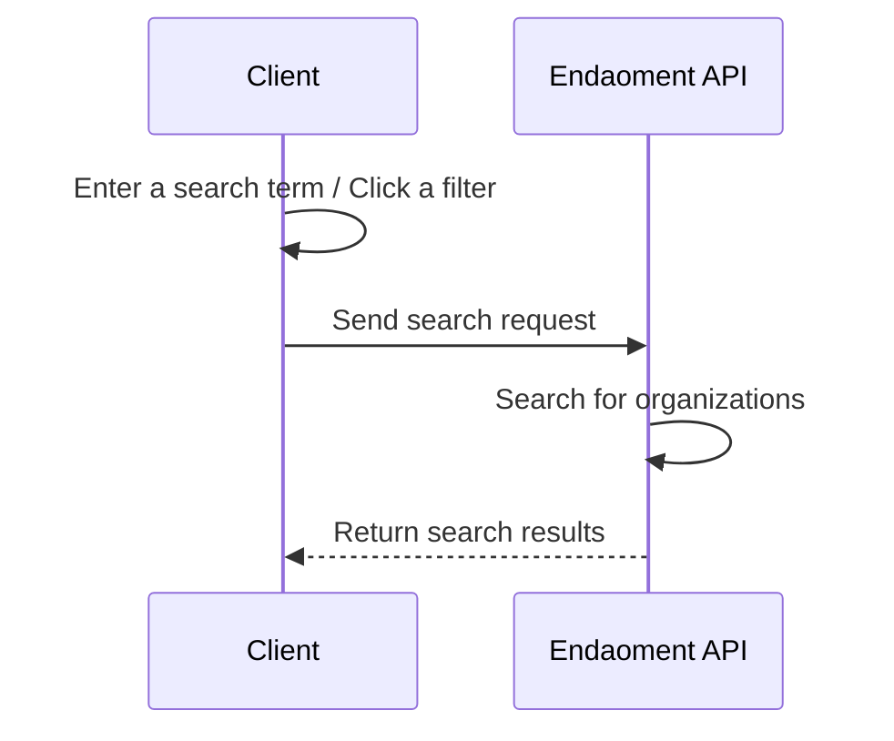

# Finding Organizations Guide

Welcome to the Finding Organizations Guide. This document will walk you through the process of finding organizations on the Endaoment platform.

We will be creating a simple search flow that will allow users to search for organizations on the Endaoment platform. This guide will cover adding a search bar to your frontend, preparing a search URL, and displaying the search results.

## Prerequisites

Before you begin, ensure you have the following:

- A frontend application or client to allow users to interact with
- Basic understanding of HTTP requests

## Flow Overview

## Step-by-Step Instructions

### 1. Prepare the search interface

> TODO

### 2. Orchestrate the search request

> TODO

### 3. Display the search results

> TODO

## Conclusion

Now your users will be able to search for organizations on the Endaoment platform. This will allow them to find causes worth giving to and learn all about what they are doing to make the world a better place. Additionally, this functionality is a key part of the granting process, as users will need to select an organization to grant to. You can learn more about the granting process in the [Granting out of a Donor-Advised Fund (DAF) Guide](./grant-from-daf.md).
