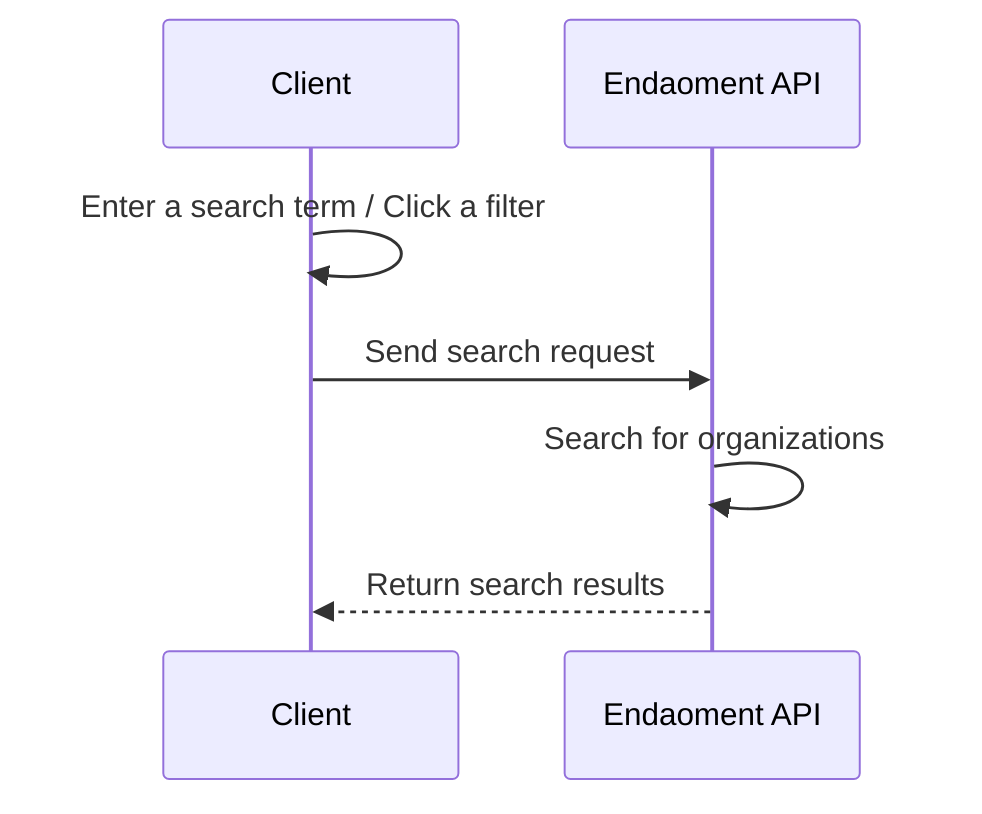

# Finding Organizations Guide

Welcome to the Finding Organizations Guide. This document will walk you through the process of finding organizations on the Endaoment platform.

We will be creating a simple search flow that will allow users to search for organizations on the Endaoment platform. This guide will cover adding a search bar to your frontend, preparing a search URL, and displaying the search results.

## Prerequisites

Before you begin, ensure you have the following:

- A frontend application or client to allow users to interact with
- Basic understanding of HTTP requests

## Flow Overview



## Step-by-Step Instructions

### 1. Prepare the search interface

In order to allow users to search for organizations, you will need to create a search interface. This can be as simple as a text input field or a more complex search form with filters for the user to select from. Please refer to the [API reference](https://api.dev.endaoment.org/oas#/Organizations/OrgsController_searchOrgs) for the available search parameters.

For this guide, we will create a simple text input field that will allow users to enter a search term. We will be using React for this example, but you can use any frontend framework or library.

```jsx
const Search = () => {
  const [searchTerm, setSearchTerm] = useState('');
  const [searchResults, setSearchResults] = useState([]);

  const handleSearch = () => {
    // Handle sending the search request
    // We will cover this in the next step
  };

  return (
    <div>
      <input
        type="text"
        value={searchTerm}
        onChange={(e) => setSearchTerm(e.target.value)}
      />
      <button onClick={handleSearch}>Search</button>
    </div>
  );
};
```

This will show users a text input for what they want to search for and a button to trigger the search request.

### 2. Orchestrate the search request

When the user finishes typing their search term and clicks the search button, you will need to send a request to the Endaoment API to search for organizations. You will need to prepare the search URL with the search term and any other parameters you want to include.

```javascript
// This should be part of the Search component in the previous step
const handleSearch = async () => {
  const searchUrl = `https://api.endaoment.com//v2/orgs/search?searchTerm=${searchTerm}`;

  try {
    const response = await fetch(searchUrl);
    const data = await response.json();

    // Set the search results in state so they can be displayed
    setSearchResults(data);
  } catch (error) {
    console.error('Error searching for organizations:', error);
  }
};
```

### 3. Display the search results

Once you have received the search results from the Endaoment API, you will need to display them to the user. This can be done in a variety of ways, such as a list of organizations with their names and descriptions.

```jsx
// Same component as before, with the addition of displaying search results
const Search = () => {
  // ...
  // state and callbacks from previous steps

  return (
    <div>
      {/* ... */}
      {/* Search input and button from previous steps */}

      {searchResults.length > 0 ? (
        <ul>
          {searchResults.map((org) => (
            <li key={org.id}>
              <h3>{org.name}</h3>
              <p>{org.description}</p>
            </li>
          ))}
        </ul>
      ) : null}
    </div>
  );
};
```

## Conclusion

Now your users will be able to search for organizations on the Endaoment platform. This will allow them to find causes worth giving to and learn all about what they are doing to make the world a better place. Additionally, this functionality is a key part of the granting process, as users will need to select an organization to grant to. You can learn more about the granting process in the [Granting out of a Donor-Advised Fund (DAF) Guide](./grant-from-daf.md).
